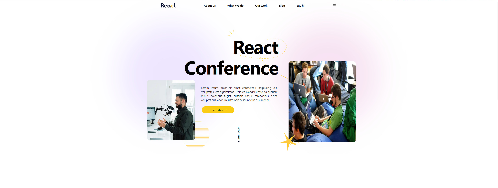
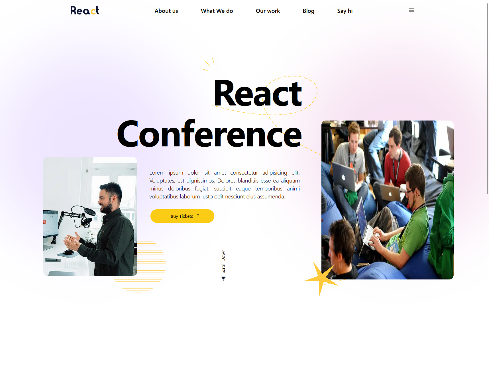
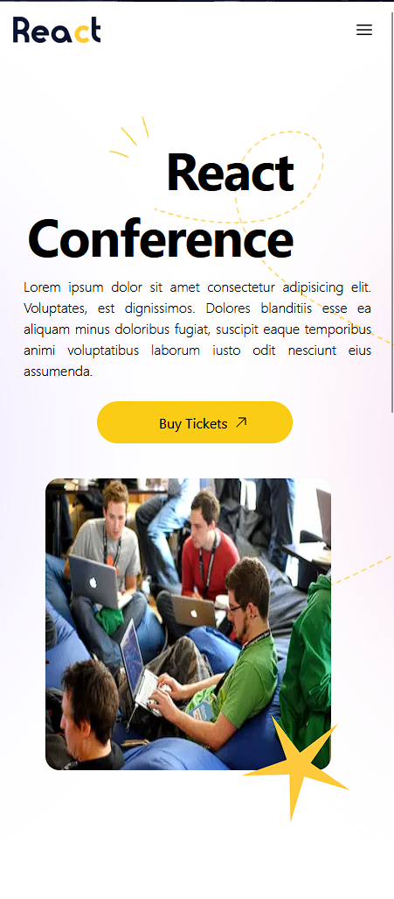
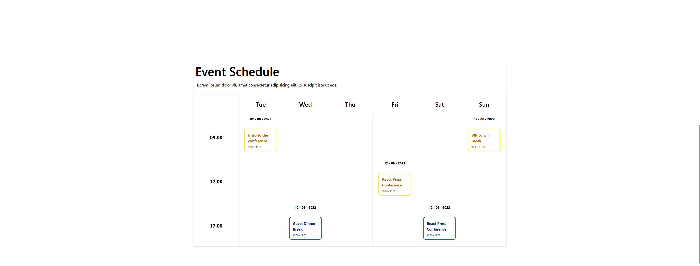
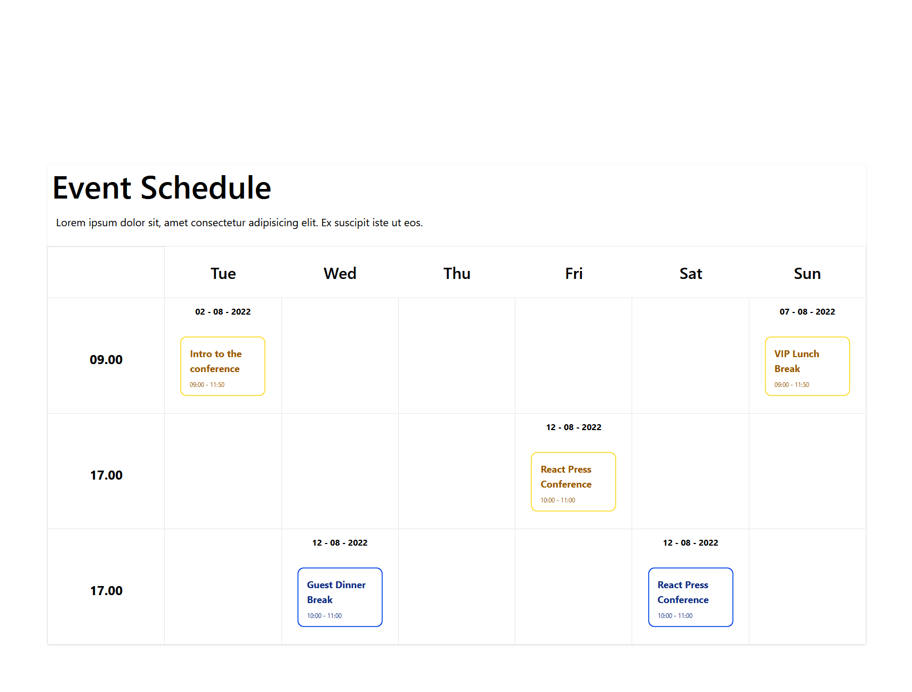
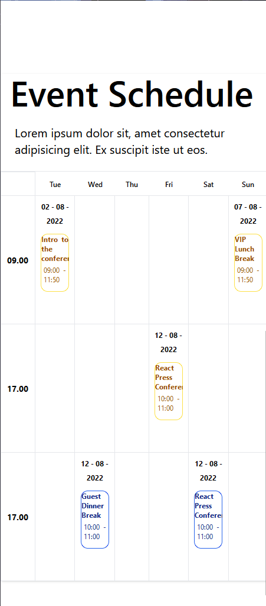
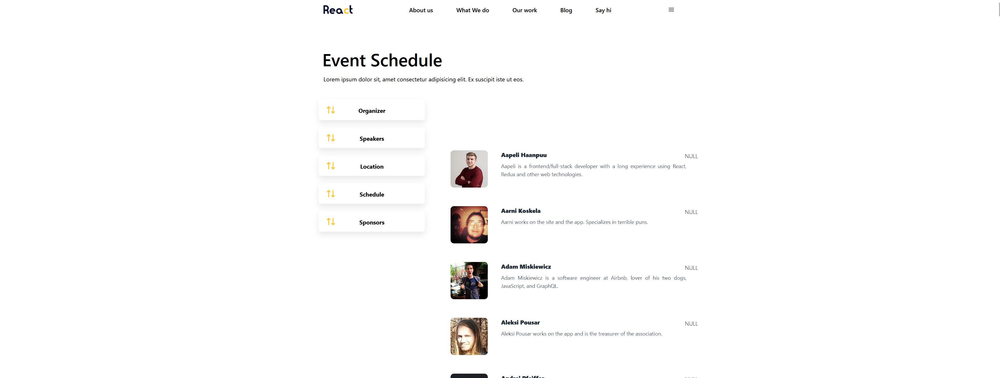
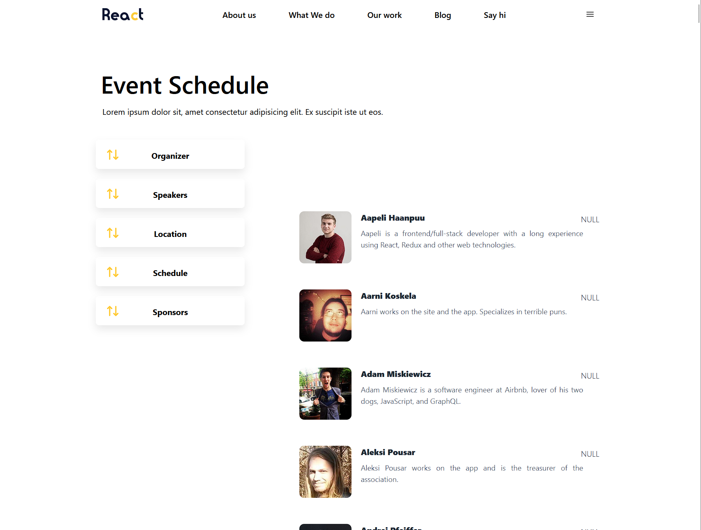
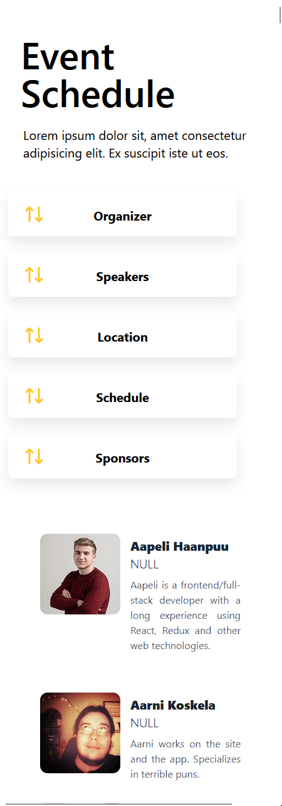

<!-- Improved compatibility of back to top link: See: https://github.com/othneildrew/Best-README-Template/pull/73 -->

<a name="readme-top"></a>

<br />
<div align="center">
  <a href="https://rhine-one.vercel.app">
    
  </a>

  <h3 align="center">React Scheduler</h3>

  <p align="center">
    LemonHive Test
    <br />
    <br />
  </p>
</div>

<!-- TABLE OF CONTENTS -->
<details>
  <summary>Table of Contents</summary>
  <ol>
    <li>
      <a href="#about-the-project">About The Project</a>
      <ul>
        <li><a href="#built-with">Built With</a></li>
      </ul>
    </li>
    <li>
      <a href="#getting-started">Getting Started</a>
      <ul>
        <li><a href="#prerequisites">Prerequisites</a></li>
        <li><a href="#installation">Installation</a></li>
      </ul>
    </li>
    <li><a href="#demo-images">Demo Images</a></li>
    <li><a href="#tree">File Tree</a></li>
    <li><a href="#usage">Usage</a></li>
    <li><a href="#contributing">Contributing</a></li>
    <li><a href="#contact">Contact</a></li>
    <li><a href="#acknowledgments">Acknowledgments</a></li>
  </ol>
</details>

<!-- ABOUT THE PROJECT -->

## About The Project

This project is a demo test project show casing the front end.

<p align="right">(<a href="#readme-top">back to top</a>)</p>

### Built With

This section should list any major frameworks/libraries used for the project.

- 
- 
- 
- 
- 
- 
- 

<p align="right">(<a href="#readme-top">back to top</a>)</p>

<!-- GETTING STARTED -->

## Demo Images











## Tree

- File Tree
  ```sh
  G:.
  ├───.next
  │   ├───cache
  │   │   ├───images
  │   │   │   ├───3-XEgmKPNjTSfPxZyOCK-lLuF+J-icKZm7IGII6xDTc=
  │   │   │   ├───3cq50yc7eFSHM3pivunZg+OqRUlGvA3I8nAtPv+we+k=
  │   │   │   ├───4dbcdeOxn6tScffUW78mFUbnn7uZUHiHX0HNTUIwr9U=
  │   │   │   ├───4lNC3Wjw-qRnKUqcLcfSltEKIFlXioXV1tLhthW7RK4=
  │   │   │   ├───6gtoeOax2nrbPO5LK7e94ejuBsqFxNrZDAL8GT9tZsU=
  │   │   │   ├───6l+6L0NnvdDCA2qQsKRJC0PyDMcNWD0IlYucJVt5S0I=
  │   │   │   ├───8Pe7Ztam8W58xLFu168TxZ5pPrIvijyW6Z08yulDEVI=
  │   │   │   ├───8ru4R3D9M9WcPvVZzHLZ6iQa7DZdrAvUkgM67BlcxnQ=
  │   │   │   ├───CKTG7nS51cVxXYVL+3Eh6Z1JrF6k7g8iPWuFXoUwMyw=
  │   │   │   ├───dfM341Fn4nSw01ePOHohtmMadz978K8rqBKjEu1ktvI=
  │   │   │   ├───dOeEYaKZ9v-M8wuGT7FoF0jJnQQSQyxuvi9tfJJ0jzs=
  │   │   │   ├───FE6qhBt1u5s3HystcAZmdg1ckqd+sIKsEzWei+5Jy74=
  │   │   │   ├───Fo3+G0bynMHpesJAzw7tq2dcyKCMco-bSCbmgWZ9S-g=
  │   │   │   ├───g4U5w5uT+7J1X-4TVCh0-GSQs2bO+i6nFqoEISMKqBE=
  │   │   │   ├───gUeVrfYUN7tWUGa0kmJ-b9+JcoOT4sy4-l+jkRjV+Bg=
  │   │   │   ├───hUJKl8rHn0xX6zqWaTlfJmGStTBIHpsZJo+6-O0FKjQ=
  │   │   │   ├───Hwbo-ihMXs-EKWMrkK6auZKLex13CMNPvVzChnMrNO8=
  │   │   │   ├───Hxabx-keyxV2sOj7TQ8B0uRJTlXXKDcRZF6ZPGdJCLo=
  │   │   │   ├───io2eXPlUR8aMEmKmCV+urIprm5V8tXj5Xx4qgeL2B1Q=
  │   │   │   ├───lmfts20IJUYvvXhiNBJ0cfZb4XKkQYxItrw84HP4TRg=
  │   │   │   ├───MC29xm3hnhtVOCGSmpGefThBmTToEwfN4SdHMBHuY0w=
  │   │   │   ├───P07TKBDc5KSZV625g4VSmc0mVT05UYhfDGKUF3ZlJC4=
  │   │   │   ├───pp9FK6E1Bmh4RbpY8RL1SVj0-IlFNPe0pVJjifWbddA=
  │   │   │   ├───QX3zo8OihoihI+-1TBFIqnlbMCSzK0LtxXLQs-x-wgY=
  │   │   │   ├───Rn9u0l8H8tSBcrr7F60ROW20EGzyFHuOrSZ5H5GgKf0=
  │   │   │   ├───sSNTy+6LnYj2M58IdU7H3HsvAGHxwhZ5lLTnSK4I8gc=
  │   │   │   ├───UE9DDV7FBHOxm9G74EUbbZNLJvEKb9sYnDTKGx5M5AI=
  │   │   │   ├───Uo5AK8cJPoIHZkTHH+KgcPdkOLbAyliFyBC-1FA3Y64=
  │   │   │   ├───vP0CF8TfyAfotTPUkGtMDf7hJ2JyQx-Vy+sbwLXLhQ0=
  │   │   │   ├───VU957e07yLW+edkrfhLvTw60KmxyPpLcAyJYKCb7sBE=
  │   │   │   ├───wr7wTN+fSTQXbzGV3kRPSPEmLDJHO2SLHa55iJtdSO8=
  │   │   │   ├───ysmHi3IqZ4RYZaXXCi1iOSZlWbxTa69ilOGwID1IkIY=
  │   │   │   ├───yxdrHh-6yigx3xpevVKtG5DBr0Djg-H95Svvq04VhXs=
  │   │   │   └───yymVkgC7N3ey+fsHjXil3A5EXQA1v+Z7sNFY2WMmyLo=
  │   │   ├───swc
  │   │   │   └───plugins
  │   │   │       └───v4
  │   │   └───webpack
  │   │       ├───client-development
  │   │       ├───client-development-fallback
  │   │       └───server-development
  │   ├───server
  │   │   └───pages
  │   └───static
  │       ├───chunks
  │       │   └───pages
  │       ├───development
  │       └───webpack
  │           └───pages
  ├───apollo
  ├───components
  ├───images
  ├───pages
  │   └───api
  ├───public
  │   └───assets
  │       └───images
  └───styles
  ```

## Getting Started

Download or clone the repo and open in VS Code.

### Prerequisites

Install Yarn or npm.

- Install
  ```sh
  npm install --global yarn
  ```

### Installation

_Copy the repo & install node modules. Then give the environment variables & run the project._

1. Clone repo
   ```sh
   git clone https://github.com/Coding-Err0r/LemonHive.git
   ```
2. Install Node modules
   ```sh
   yarn install
   ```
3. Run Project
   ```sh
   yarn dev
   ```

<p align="right">(<a href="#readme-top">back to top</a>)</p>

<!-- USAGE EXAMPLES -->

## Usage

Read the official Next JS docs for more information.

_For more examples, please refer to the [Documentation](https://nextjs.org/)_

<p align="right">(<a href="#readme-top">back to top</a>)</p>

<!-- CONTRIBUTING -->

## Contributing

Contributions are what make the open source community such an amazing place to learn, inspire, and create. Any contributions you make are **greatly appreciated**.

If you have a suggestion that would make this better, please fork the repo and create a pull request. You can also simply open an issue with the tag "enhancement".
Don't forget to give the project a star! Thanks again!

1. Fork the Project
2. Create your Feature Branch (`git checkout -b feature/AmazingFeature`)
3. Commit your Changes (`git commit -m 'Add some AmazingFeature'`)
4. Push to the Branch (`git push origin feature/AmazingFeature`)
5. Open a Pull Request

<p align="right">(<a href="#readme-top">back to top</a>)</p>

<!-- LICENSE -->

## License

Distributed under the MIT License. See `LICENSE.txt` for more information.

<p align="right">(<a href="#readme-top">back to top</a>)</p>

<!-- CONTACT -->

## Contact

Your Name - [@ErrorrCoding](https://twitter.com/ErrorrCoding) - rhine.cse@gmail.com

Project Link: [Porject Link](https://github.com/Coding-Err0r/LemonHive.git)

<p align="right">(<a href="#readme-top">back to top</a>)</p>

<!-- ACKNOWLEDGMENTS -->

## Acknowledgments

Use this space to list resources you find helpful and would like to give credit to. I've included a few of my favorites to kick things off!

- [Choose an Open Source License](https://choosealicense.com)
- [GitHub badges](https://github.com/Ileriayo/markdown-badges)

<p align="right">(<a href="#readme-top">back to top</a>)</p>

<!-- MARKDOWN LINKS & IMAGES -->
<!-- https://www.markdownguide.org/basic-syntax/#reference-style-links -->

[contributors-shield]: https://img.shields.io/github/contributors/othneildrew/Best-README-Template.svg?style=for-the-badge
[contributors-url]: https://github.com/othneildrew/Best-README-Template/graphs/contributors
[forks-shield]: https://img.shields.io/github/forks/othneildrew/Best-README-Template.svg?style=for-the-badge
[forks-url]: https://github.com/othneildrew/Best-README-Template/network/members
[stars-shield]: https://img.shields.io/github/stars/othneildrew/Best-README-Template.svg?style=for-the-badge
[stars-url]: https://github.com/othneildrew/Best-README-Template/stargazers
[issues-shield]: https://img.shields.io/github/issues/othneildrew/Best-README-Template.svg?style=for-the-badge
[issues-url]: https://github.com/othneildrew/Best-README-Template/issues
[license-shield]: https://img.shields.io/github/license/othneildrew/Best-README-Template.svg?style=for-the-badge
[license-url]: https://github.com/othneildrew/Best-README-Template/blob/master/LICENSE.txt
[linkedin-shield]: https://img.shields.io/badge/-LinkedIn-black.svg?style=for-the-badge&logo=linkedin&colorB=555
[linkedin-url]: https://linkedin.com/in/othneildrew
[product-screenshot]: images/screenshot.png
[next.js]: https://img.shields.io/badge/next.js-000000?style=for-the-badge&logo=nextdotjs&logoColor=white
[next-url]: https://nextjs.org/
[react.js]: https://img.shields.io/badge/React-20232A?style=for-the-badge&logo=react&logoColor=61DAFB
[react-url]: https://reactjs.org/
[vue.js]: https://img.shields.io/badge/Vue.js-35495E?style=for-the-badge&logo=vuedotjs&logoColor=4FC08D
[vue-url]: https://vuejs.org/
[angular.io]: https://img.shields.io/badge/Angular-DD0031?style=for-the-badge&logo=angular&logoColor=white
[angular-url]: https://angular.io/
[svelte.dev]: https://img.shields.io/badge/Svelte-4A4A55?style=for-the-badge&logo=svelte&logoColor=FF3E00
[svelte-url]: https://svelte.dev/
[laravel.com]: https://img.shields.io/badge/Laravel-FF2D20?style=for-the-badge&logo=laravel&logoColor=white
[laravel-url]: https://laravel.com
[bootstrap.com]: https://img.shields.io/badge/Bootstrap-563D7C?style=for-the-badge&logo=bootstrap&logoColor=white
[bootstrap-url]: https://getbootstrap.com
[jquery.com]: https://img.shields.io/badge/jQuery-0769AD?style=for-the-badge&logo=jquery&logoColor=white
[jquery-url]: https://jquery.com
